# InGateway902 Docker user manual
InGateway902 series edge computing gateway (IG902 for short) supports manage docker images. You can publish your docker images to IG902 to quickly deploy and run applications developed by yourself. In order to introduce how to use IG902's Docker environment, this document will demonstrate how to run an Nginx image on IG902. This image is used for open source reverse proxy server for HTTP, HTTPS, SMTP, POP3 and IMAP protocols, and load balancer, HTTP cache And web server.   
Docker is an open source application container engine that allows developers to package their applications and dependencies into a portable container and then publish it to any popular Linux machine or Windows machine. It can also be virtualized. The container is completely with the sandbox mechanism, there will be no interface between each other.

## Prepare IG902 Hardware and Network Environment
### Connect IG902 to the Power Source and to a PC with a Network Cable
Connect IG902 to the power source and to a PC with an Ethernet cable according to the topology diagram.    
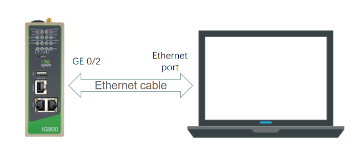

#### Set LAN Parameters: Access the IG902 Through LAN
To set the IG900 LAN network parameters, see [Access the IG900 Through LAN](https://ingateway-development-docs-en.readthedocs.io/en/latest/IG902%20Quick%20Start%20Manual.html#set-lan-parameters-access-the-ig902-through-lan).

#### Set WAN Parameters: Connect IG902 to the Internet
To set the IG900 WAN network parameters, see [Connect IG900 to the Internet](https://ingateway-development-docs-en.readthedocs.io/en/latest/IG902%20Quick%20Start%20Manual.html#set-wan-parameters-connect-ig902-to-the-internet).

### Update the firmware
To obtain the latest firmware version of IG902 and updated functions, contact the customer service center. To update the IG902 firmware, see [Update the IG900 Software](https://ingateway-development-docs-en.readthedocs.io/en/latest/IG902%20Quick%20Start%20Manual.html#update-the-software). (The firmware version should be 2.0.0.r12057 and above)

## Enable and configure Docker manager
### Install Docker SDK and enable Docker manager
The Docker SDK integrates the operating environment and docker image manager required to run the docker image. Before using Docker, you must install the Docker SDK. To obtain the Docker SDK, please contact the customer service center.   
- Step 1: If you already have the Docker SDK, choose Edge Computing > Docker Manager page of IG902, close the Docker Manager and import the Docker SDK.
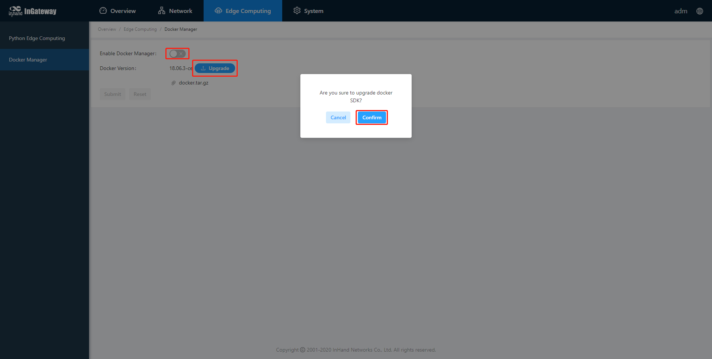   
   &nbsp;

- Step 2: After importing, IG902 will automatically install the Docker SDK. The installation process usually takes 1-2 minutes. Please be patient. After successful installation, select Enable Docker Manager and click Submit.
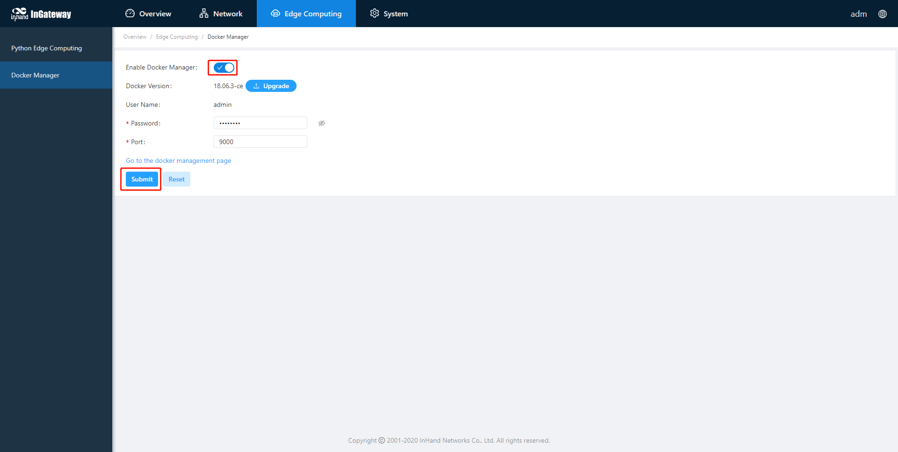   
   &nbsp;
   
- Step 3: Then you can modify the port number and login password to access the Docker manager.
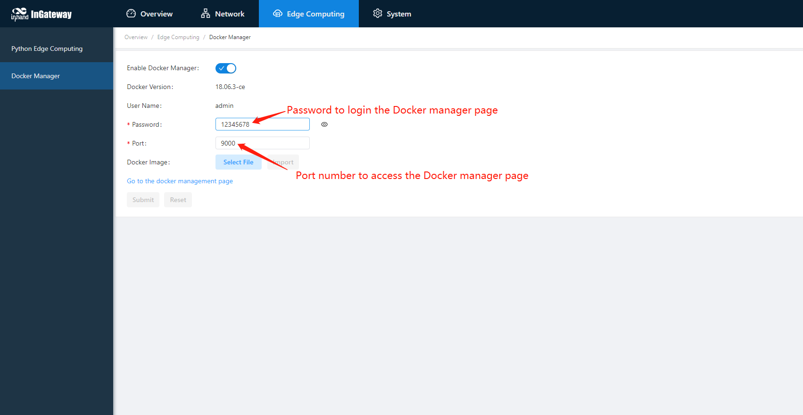

### Configure Docker Manager--Portainer
IG902 uses Portainer to build, manage and maintain Docker images and containers. For a detailed introduction and instructions on Portainer, please see the [Portainer official website](https://www.portainer.io/overview/). This document will show you how to add and deploy an Nginx docker image on IG902.

#### Access Portainer
- Step 1: Click Portainer's access button, and Portainer will prompt you to enter your username and password. At this time, copy the user name and the set password from the Edge Computing > Docker Manager page of IG902 and click Login.
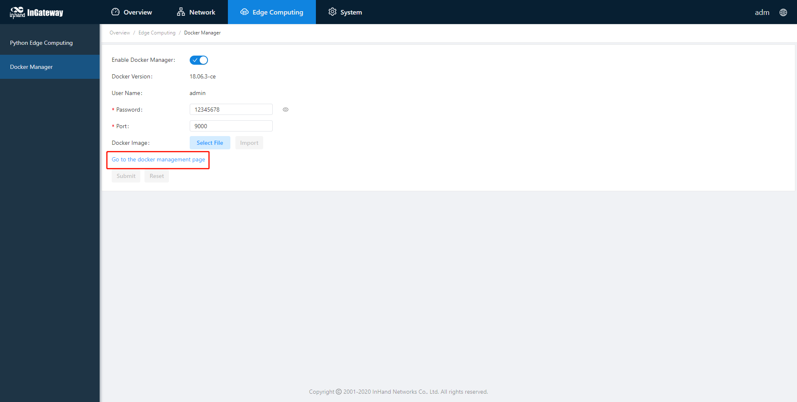
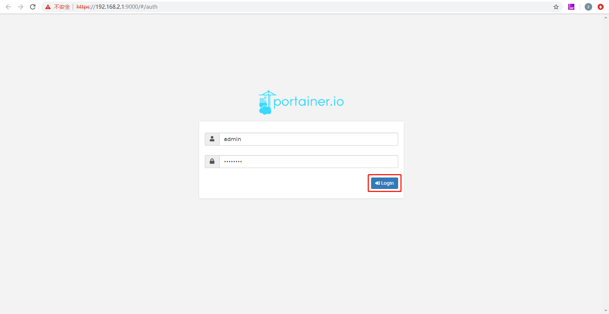   
   &nbsp;
   
- Step 2: After the login is successful, as shown in the figure below, select Local to use the Portainer to manage the docker image on the IG902, and then click Connect.
   
   &nbsp;
   
- Step 3: On the Home page of Portainer, select local to manage the docker image on IG902.
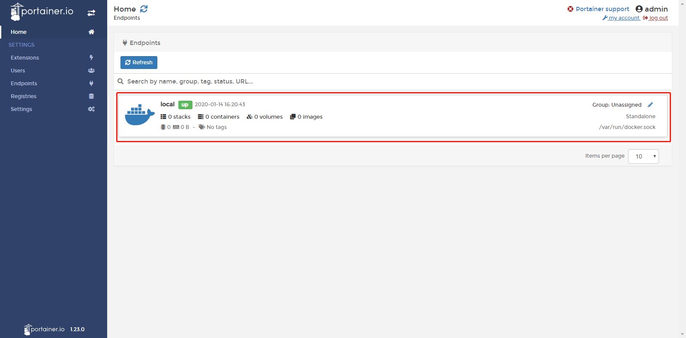   
   &nbsp;
   
  Then you will jump to the local dashboard, where you can get an overview of the IG902's containers and images.

#### Add docker image
There are two ways to add docker images for Portainer：
- Method 1: Import the local docker image from the Edge Computing > Docker Manager page of IG902. (The time required for import varies depending on the size of the docker image; please be patient when the docker image is large.)
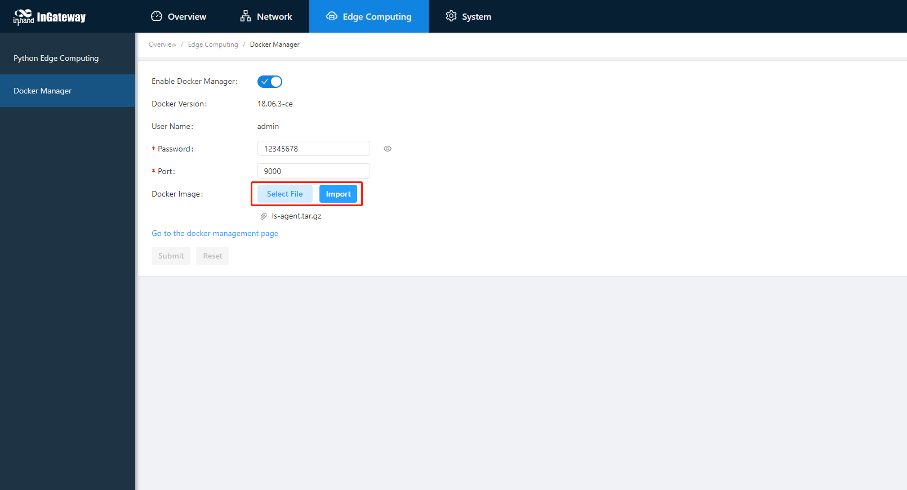   
   &nbsp;
   
  You can see the docker image successfully imported on the Local > Images page of Portainer.
   
   &nbsp;
   
- Method 2: Choose Local > Images page of Portainer and download the nginx docker image from DockerHub. (The time required to download the image varies depending on the size of the image; please be patient when the docker image is large)
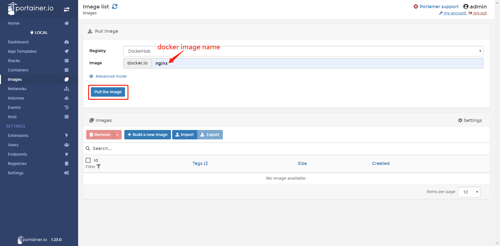   
   &nbsp;
   
  After the docker image is downloaded, you can see the corresponding docker image information in Local > Images as shown below: 

#### Configure and deploy container
- Step 1: Choose Local > Containers page of Portainer and click Add container to add a new container.
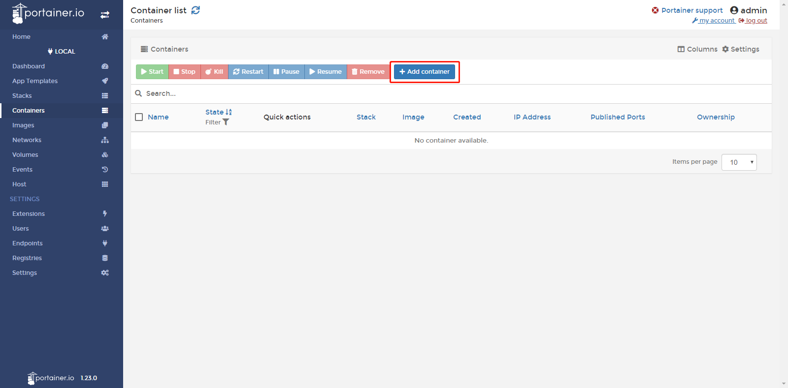   
   &nbsp;
   
- Step 2: Configure the operating parameters for the container and deploy the container.
   
   &nbsp;
   
- Step 3: The container will run automatically after deployment. You can view the container running status on Portainer's Local > Containers page.
   
   &nbsp;
   
- Step 4: After entering the Nginx access link (IP address + port number of IG902) configured in the container in the browser, you can see the Nginx welcome page.This shows that the Nginx docker image has been running on the IG902 normally. Now, you have completed adding and deploying an Nginx docker image on the IG902.
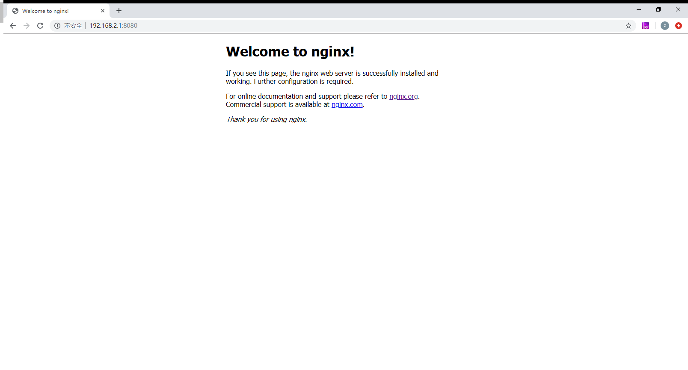

## Appendix
### How to download docker images from gitlab / github 
Choose Local > Registries page of Portainer and click Add registry to add a docker mirror repository (must be a public repository).
   

Then select Custom registry and configure the mirror repository information. After configuration, click Add registry.
   

After the mirror repository is successfully added, you can see the web page as shown below:
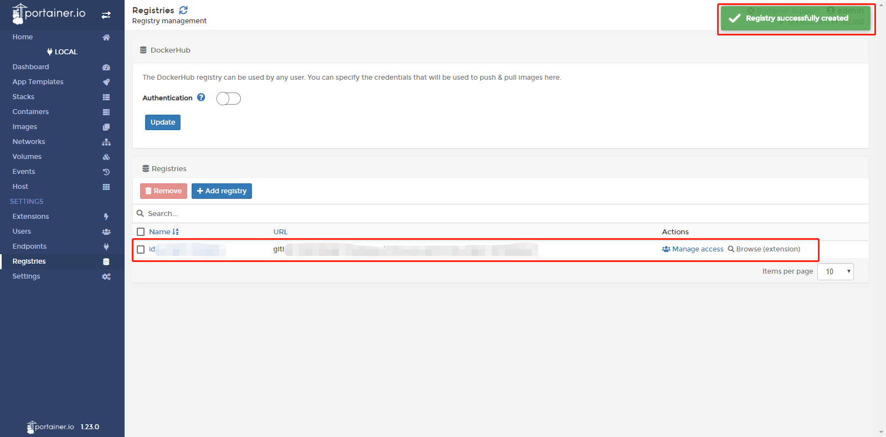   

After the addition is successful, you can select the configured image repository when pulling the docker image.

