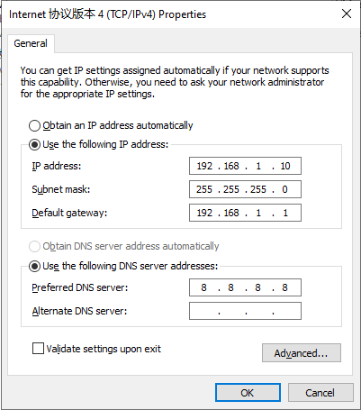
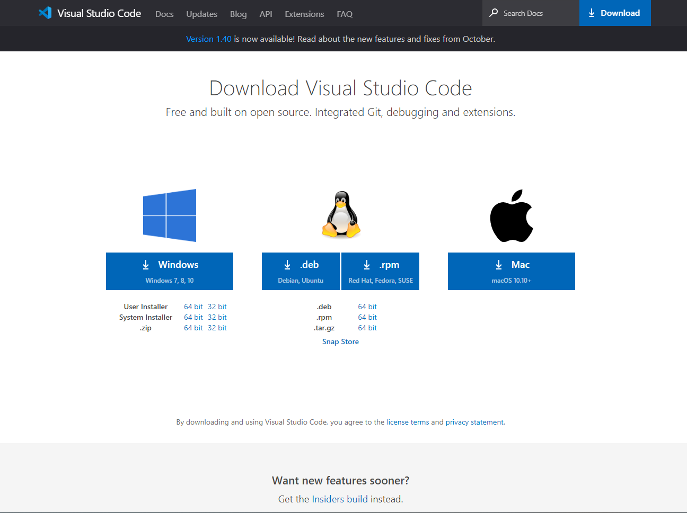
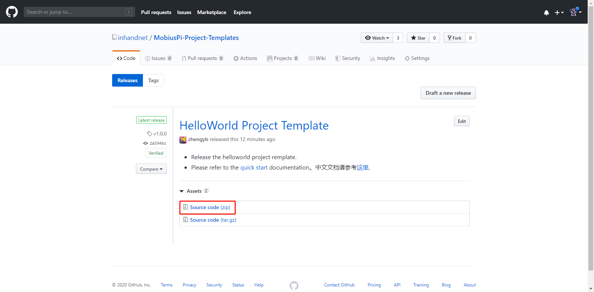
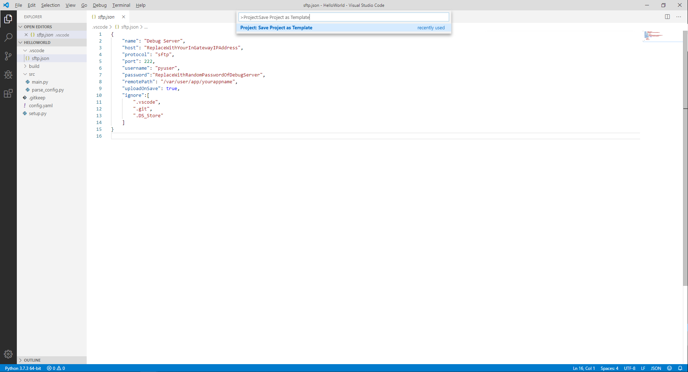
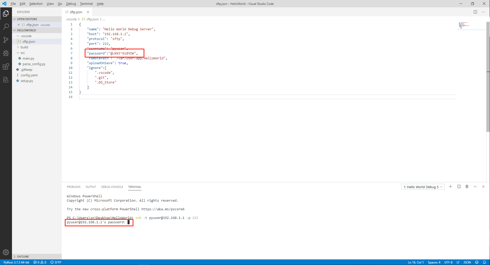
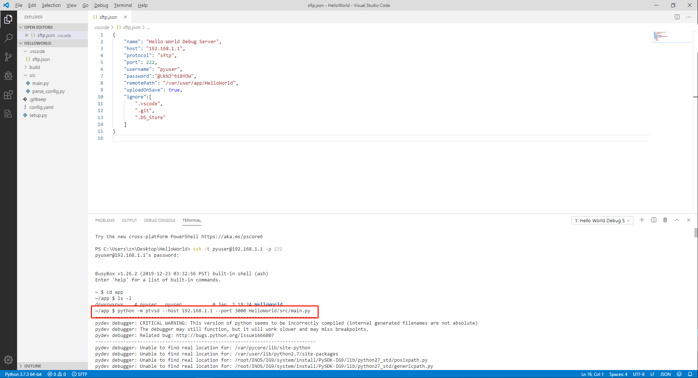
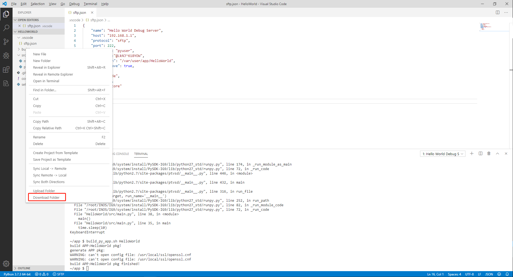
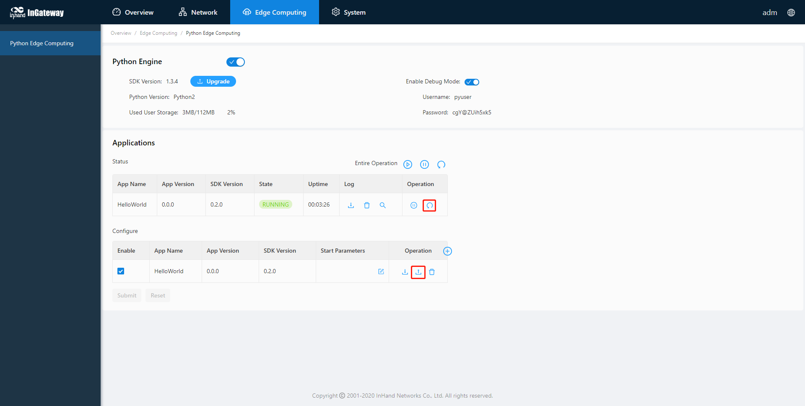
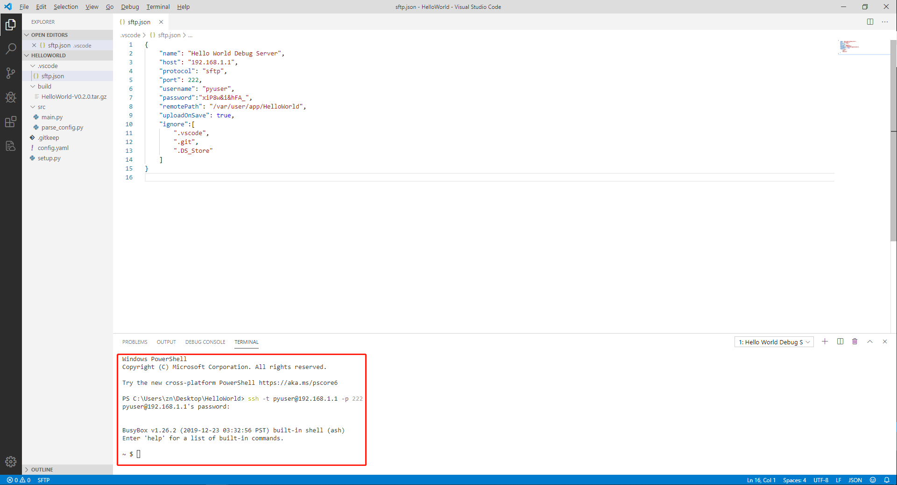

# **MobiusPi Python Development Quick Start**
MobiusPi is the code name of InGateway series software and hardware products of Beijing InHand Networks Technology Co., Ltd.  <br/> The InGateway includes two main product series, InGateway900 and InGateway500. This document uses InGateway500 series (IG500 for short) as an example to demonstrate how to develop Python App with MobiusPI.
## Building the MobiusPi Development Environment
### Prepare IG500 Hardware and Network Environment
#### Connect IG500 to the Power Source and to a PC with a Network Cable
Connect IG500 to the power source and to a PC with an Ethernet cable according to the topology diagram.

#### Set LAN Parameters: Access the IG500 Through LAN
- Step 1: Set the PC's IP address to be on the same subnet with FE 0/1. By default, the IP address of FE 0/1 on IG500 is 192.168.1.1.  
  - Method 1: Enable the PC to obtain an IP address automatically (recommended).  

      <br/>
 &nbsp;

  - Method 2: Set a fixed IP address <br/>
     Select Use the following IP address, enter an IP address (By default,any from 192.168.1.2 to 192.168.1.254), subnet mask (By default,255.255.255.0), default gateway (By default,192.168.1.1), and DNS server address, and click OK.  <br/>
     
<br/>

- Step 2: Launch the browser on the PC and access the IP address of FE 0/1. Enter the login user name and password. The default user name and password are adm and 123456 respectively.  
   
 &nbsp;

- Step 3: After successful login, you can see the web page as shown below:
   
 &nbsp;

- Step 4: To change the user name and password for logging in to the web management interface of IG500, choose System > User Management and set the new user name and password.
   
&nbsp;

- Step 5: To change the IP address of FE 0/1, choose Network > Network Interfaces > Ethernet to configure FE 0/1.
  

#### Connect IG500 to the Internet
- Step 1: Insert the SIM card. (Note: Before inserting or removing the SIM card, unplug the power cable; otherwise, the operation may cause data loss or damage the IG500.) After inserting the SIM card, connect the 4G LTE antenna to the ANT interface and power on the IG500.

   <br/>
 &nbsp;

- Step 2: Choose Network > Network Interfaces > Cellular and select Enable Cellular.

&nbsp;

  When the network connection status is Connected and an IP address has been allocated, the IG500 has been connected to the Internet with the SIM card.  


#### Update the Software
To obtain the latest version of IG500 and updated functions, contact the customer service center. To update the IG500 firmware or Python SDK, do as follows:
- Update the IG500 firmware.  <br/>
  Choose System > Firmware Upgrade. Select a firmware file and click Start Upgrading. After the update is completed, you are prompted to restart the system to Apply the new firmware.

 &nbsp;

- Upgrade the Python SDK of IG500.  <br/> 
Choose Edge Computing > Python Edge Computing. Select Python Engine, select an SDK file, and click Upgrade. Then the IG500 automatically performs the upgrade.


#### Enable the Debug Mode of IG500
If you need to run and debug Python code on IG500 during development, you need enable the debug mode for IG500. Choose Edge Computing > Python Edge Computing and select Enable Debug Mode. Then you can develop IG500 with VS Code.

 &nbsp;

After the debugging mode is enabled, IG500 will start an SSH server to listen on port 222 of LAN (default IP address being 192.168.1.1). The user name and password of the SSH server are displayed on the previous web page. A random password is generated every time the debugging mode is enabled or the IG500 is restarted to ensure security.

### Install Software on PC
#### Install a Python Interpreter
The PC must be installed with a Python2.7.X or 3.7.X interpreter (3.7.X is recommended). You can visit https://www.python.org/downloads/ to download the installation package and install it on your PC.


#### Install Visual Studio Code
Obtain the Visual Studio Code software (VS Code for short) from https://code.visualstudio.com/Download.

 &nbsp;

Download the software and run the installation program. After the software is successfully installed, launch the VS Code software, as shown below.

### Prepare the Development Environment of VS Code
#### Install the VS Code Plug-ins
To develop and debug Python code on IG500, you need to install the following plug-ins in Extensions of VS Code IDE.  
- `Python`: a VS Code Python plug-in with abundant functions and features, including IntelliSense, linting, debugging, code navigation, code formatting, Jupyter notebook support, refactoring, variable explorer, test explorer, snippets, and more! To get more information, visit the [official website](https://code.visualstudio.com/docs/languages/python) of the plug-in.  
- `Project Templates`: a VS Code extended plug-in used to quickly create projects based on custom templates. We will release several Python App templates. You can use Project Templates to import templates and quickly initialize projects.  
- `SFTP`: used to upload code to IG500 with the SFTP Sync plug-in.
  

    

    
 &nbsp;

Now, all the plug-ins required for developing MobiusPi edge computing platform are installed. To know more about VS Code plug-ins, visit [Visual Studio Code official website](https://code.visualstudio.com/).

#### Configure the Python Interpreter Version
Use the shortcut keys `Ctrl+Shift+P` to display the command interface. Enter `>Python:select Interpreter`  in the command interface.

 &nbsp;

Select the required Python interpreter. In this source, Python 3.7.X interpreter is used. (The selected interpreter version should be the same as that in Edge Computing > Python Edge Computing > Edge Computing Engine.) Then the selected Python interpreter version is displayed on the left bottom of the VS Code interface.


#### Configure Project Templates
##### Use the Standard Project Templates of InHand
- Step 1: Download MobiusPi project template from [here](https://github.com/inhandnet/MobiuspiProjectTemplates/releases).  </br>
MobiusPi provides various project templates for you to quickly initialize project directories. For details about project templates, see [README.md](https://github.com/inhandnet/MobiuspiProjectTemplates). This course uses the standard project template "helloworld-template" as an example.  

 &nbsp;

- Step 2: Open a project template.  </br>
Decompress the downloaded project template package, run VS Code to open the helloworld-template folder, choose File > Open Folder, and select the helloworld-template folder.

 &nbsp;

  Open the project template folder helloworld-template, as shown below. The project template includes:
  - `.vscode`: VS Code configuration folder
    - `sftp.json`: SFTP plug-in configuration file, used to set up SFTP connections with the IG500
  - `build`: folder of App release package
  - `src`: folder of App source code
    - `main.py`: App entrance
    - `parse_config.py`: App configuration file parsing
  - `config.yaml`: App configuration file
  - `setup.py`: information such as App version and SDK version  

  
 &nbsp;

- Step 3: Enter `>Project:Save Project as Template` on the command interface to save the current project file as a template.

 &nbsp;

  Name your template, for example, helloworld-template.


##### Customize Project Template
- Step 1: Create a project template folder, which must include the following content. You can add other information according to your needs.
  - `.vscode`: VS Code configuration folder (Entering `>SFTP:Config` on the VS Code command interface can quickly create a .vscode folder and an sftp.json file.)
    - `sftp.json`: SFTP plug-in configuration file, used to set up SFTP connections with the IG500
  - `build`: folder of App release package
  - `src`: folder of App source code
    - `main.py`: App entrance
  - `config.yaml`: App configuration file, of which the content can be customized
  - `setup.py`: information such as App version and SDK version. It is recommended to customize the information based on the standard template.  
   &nbsp;

- Step 2: Run VS Code to open the custom project template folder, choose File > Open Folder, and select the custom project template folder.
 &nbsp;

- Step 3: Enter `>Project:Save Project as Template` on the command interface to save the current project file as a template.

## Compiling the First MobiusPi App: Hello World
In this course, an App named HelloWorld is used as an example to describe how to develop Python Apps with VS code on IG500. This App can print a "hello world!" log on IG500 every 10s, import configuration files to modify log content.
### Use Template to Create Project
- Step 1: Use VS Code to open the Python App project folder, as shown below:

 &nbsp;

- Step 2: Enter `>Project:Create Project From Template` on the command interface to quickly create a project directory by using an existing template.

 &nbsp;

- Step 3: Enter the template name of helloworld-template and press Enter.

 &nbsp;

  After you select a template, VS Code automatically adds the files included in the template to the current project directory.


### Coding
The standard project template helloworld-template can print a "hello world!" log on IG500 every 10s, import configuration files to modify log content. To change the App name, modify the code in `main.py` and `setup.py` as follows: <font color=#FF0000>(Note: The Python App names cannot contain spaces.) </font>
  


### Debugging
#### Set Up an SFTP Connection
Before debugging code remotely, you need to upload the local code to a remote server, namely, the IG500. Before uploading the code, ensure that the debug mode of IG500 has been enabled as follows:

 &nbsp;

- Step 1: Open the `sftp.json` file.  <br/>
  Enter `>SFTP:Config` on the command interface to open the `sftp.json` file.

 &nbsp;

- Step 2: Configure the SFTP connection.  <br/>
  In the `sftp.json` file, configure the SFTP connection according to the parameters on the Edge Computing > Python Edge Computing interface.
  <font color=#FF0000>Note: The Python App name must be the same as the App name in `mian.py`. </font>

  
 &nbsp;

- Step 3: When the configuration is completed and saved, enter `>SFTP:Open SSH in Terminal` on the command interface to connect to the remote server.

 &nbsp;

- Step 4: You are prompted to enter the SFTP server's IP address, namely, host.

 &nbsp;

- Step 5: If it is the first time to set up the SFTP connection, the TERMINAL window displays a message asking you whether to continue the connection. Enter Yes and press Enter. Enter `>SFTP:Open SSH in Terminal` and SFTP server's IP address on the command interface again.

 &nbsp;

- Step 6: When the TERMINAL window prompts you to enter the password, you only need to copy the password in the `sftp.json` file.

 &nbsp;

  When the SFTP connection is successfully set up with IG500, the following information is displayed:


#### Debug Code
- Step 1: Synchronize code.
  After the SFTP connection is set up, right-click on a blank space in the left area and choose Sync Local > Remote from the shortcut menu to synchronize the local code to the remote server. After the code is synchronized, the modification or deletion of the local code will also be synchronized to the remote server.

 &nbsp;

  You can check whether the remote server has received the App code in TERMINAL window. Enter the following commands in the TERMINAL window to show the uploaded App folder information:
  ```
  cd app  
  ls -l
  ```
  
 &nbsp;

- Step 2: Debug the script in the TERMINAL window.
  After the code is synchronized, enter the command as follows to run the script on IG500. When the script is running, check whether the running result in the TERMINAL window printing "hello world!".
  ```
  python -m ptvsd --host 192.168.1.1 --port 3000 HelloWorld/src/main.py 
  ```
  - `192.168.1.1`: IP address of FE 0/1 on IG500
  - `3000`: recommended debugging port number
  - `HelloWorld/src/main.py`: execution path of `mian.py`, which should be modified according to your needs.  <br/>
&nbsp;

  The Python development environment of IG500 has a built-in ptvsd dependent library for remote code debugging. To learn about more usage information about ptvsd plug-in, see [ptvsd usage](https://github.com/microsoft/ptvsd/).
    

  
 &nbsp;

- Step 3: After debugging is completed, press `Ctrl + C` on terminal to terminate the debugging.


### Construct App Release Package
When the debugging is completed, you can construct the App release package so that the App can be quickly deployed to other IG500s.
- Step 1: Construct an App release package.  <br/>
  Run the `build_py_app.sh HelloWorld` command in the TERMINAL window to construct an App release package, namely, the build_py_app.sh Python App name.

 &nbsp;

- Step 2: Download the App release package.  <br/>
  An App release package is automatically generated in the build directory on the remote server. Right-click the local build folder and click Download Folder to download the constructed App release package for future deployment.

 &nbsp;

  After the download is completed, you can see the HelloWorld App release package in the build directory.


### Deploy App on the InGateway Web Page
After you run the App release package construction command, the App is automatically generated on the connected IG500, but this APP cannot be started normally. Please follow the procedure to deploy APP to IG500:
- Step 1: Upload the App.  <br/>
  Choose Edge Computing > Python Edge Computing on the IG500, and click the add button.

 &nbsp;

  Select the HelloWorld release package in the "build" directory.

&nbsp;

- Step 2: Enable the App.  <br/>
  After the upload, select the Enable checkbox of HelloWorld and click Submit. Then the App automatically runs and will run every time the IG500 is started.

 &nbsp;

  On the App status interface, you can see that the App has successfully run on the IG500. The HelloWorld App deployment is completed.


### Check App Status
Choose Edge Computing > Python Edge Computing on the IG500. You can see the running status of the App.


Click the log viewing icon to display the running log of the App.
  


### Update Configuration File for App
- Step 1: Modify the configuration file.  <br/>
  Modify ```description:"hello world!"``` in the config.yaml file of the App into  ```description: "hello inhand!"```.  <br/>
 <br/>
 &nbsp;

- Step 2: Import the configuration file and restart the App.  <br/>
  Choose Edge Computing > Python Edge Computing on the IG500, import the modified configuration file of HelloWorld, and restart the App.  

 &nbsp;

After the restart, the HelloWorld App runs with the modified configuration file. That is, it prints a "hello inhand!" log every 10s.  <br/>

### Appendix
#### Use pip to Install the Dependent Library for App
To install the dependent library for App with pip, you need to enable the debugging mode for the IG500 and connect the IG500 to the Internet.
  


- Step 1: Use VS Code to set up an SFTP connection with the IG500. For details, see [Set Up an SFTP Connection](https://ingateway-development-docs-en.readthedocs.io/en/latest/QuickStart.html#set-up-an-sftp-connection).

 &nbsp;

- Step 2: Run pip install + dependent library name + ==version number + -t + lib folder path of the App, and press Enter to install the dependent library. (If the version number is not included, pip automatically installs the dependent library of the latest version.) 
  ```
  pip install xlrd==1.2.0 -t /var/user/app/HelloWorld/lib/
  ```

  
 &nbsp;

- Step 3: The dependent library is automatically downloaded and installed. When the installation is successful, the following information is displayed.

 &nbsp;

- Step 4: Run the `export` command to set the environment variables for the App. Run the following commands in the TERMINAL window.
  ```
  export LD_LIBRARY_PATH=$LD_LIBRARY_PATH:/var/user/app/HelloWorld/lib/  
  export PYTHONPATH=$PYTHONPATH:/var/user/app/HelloWorld/lib/
  ```
  
 &nbsp;

  If a dependent library is installed for the App, you must configure the environment variables for the App before debugging; otherwise, the App cannot run normally during debugging.   
  After enabling the App in IG500, the environment variables of the third-party dependent library in the App's lib folder will be automatically added to the APP, without manual configuration.<br/>
 &nbsp;

- Step 5: Execute code to ensure that the App runs normally.
  

#### Enable Automatic Code Completion
To improve the coding efficiency, enable automatic code completion by using Python extended plug-ins.
- Step 1: Choose File > Preferences > Settings.

 &nbsp;

- Step 2: Choose Extensions > Python. Find out Auto Complete: Extra Paths and click Edit in setting.json.

 &nbsp;

  Add the following items to settings.json and save the settings (python.pythonPath is the installation path of the Python interpreter.)
  ```
  "python.linting.pylintEnabled":false,
  "python.linting.flake8Enabled":true,
  "python.jediEnabled":true,
  "terminal.integrated.rendererType":"dom",
  "explorer.confirmDelete":false,
  "python.pythonPath":"C:/Users/zn/AppData/Local/Programs/Python/Python37",
  ```
  

#### FAQs
- Q1: What Can I Do If the Remote Host Key Is Change and Verification Fails During the Setup of an SFTP Connection?

 &nbsp;

  A1: The possible reason is that the key of IG500 has been changed, but the key on the PC has not been updated. Therefore, the verification fails. You only need to delete the conflict line in the key file. (Pressing Ctrl and clicking the conflict item at the same time can quickly access the link.)

 &nbsp;

  After the deletion, run the `>SFTP:Open SSH in Terminal` command again to create the SFTP connection.

 &nbsp;

- Q2: After the SFTP Connection Is Successfully Set Up, I Right-Click the Blank Space in the Left Area, and Choose Sync Local > Remote to Synchronize Code to the Remote Server. However, All Authentication Methods Fail. What Can I Do?

 &nbsp;

  A2: Ensure that the password in the sftp.json file is the same as the password of the IG500. Then set up the SFTP connection and synchronize code again.
